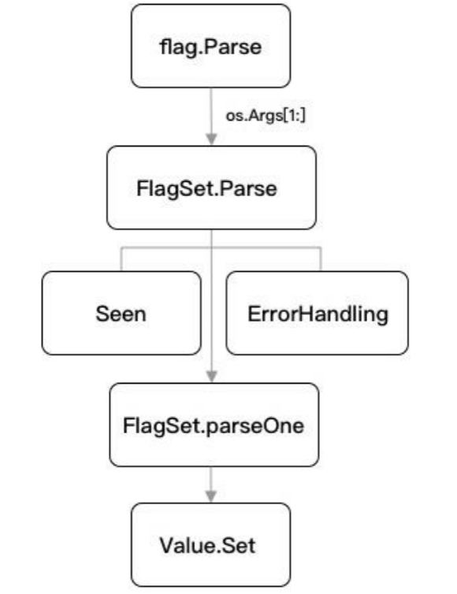

## 1.1 工具之旅

本章节学习目标是跟着教材，学习打造自己的工具集，提高工作效率。

### 1.1.1 标准库flag

- 标准库`flag`，主要功能是实现命令行参数的解析。

- 后续使用开源项目`Cobra`构建CLI应用程序，K8s、Hugo、etcd、Docker都是使用Cobra构建的。

### 1.1.2 初始化项目

初始化步骤：

- 创建工作路径
- 切换到`tour`目录
- 初始化项目Go modules

```bash
$ mkdir -p $HOME/go-programming-tour-book/tour
$ cd $HOME/go-programming-tour-book/tour
$ go mod init github.com/go-programming-tour-book/tour
go: creating new go.mod: module github.com/go-programming-tour-book/tour
```

如果初始化Go modules出错，则开启Go modules：

```bash
$ go env -w GO111MODULE=on
```

另外，设置国内镜像代理，解决可能因为网络不通无法更新包：

```bash
$ go env -w GOPROXY=https://goproxy.cn,direct
```

### 1.1.3 示例

#### 1. 标准库flag的基本使用和长短选项

**示例代码** `example/ex-1.go`

```go
package main

import (
	"flag"
	"log"
)

func main() {
	var name string
	flag.StringVar(&name, "name", "Go语言编程之旅", "帮助信息")
	flag.StringVar(&name, "n", "Go语言编程之旅", "帮助信息")
	flag.Parse()

	log.Printf("name: %s", name)
} 
```

上述代码可以调用标准库`flag`的`StringVar`方法，并实现对命令行参数`name`的解析和绑定，各参数分别为：命令行标识位的名称、默认值、帮助信息。支持如下三种命令行标志语法：

- `-flag` ：仅支持布尔类型
- `-flag x` ：仅支持非布尔类型
- `-flag=x` ：都支持

> 使用`-flag` 这种方式的时候，只要在命令行的时候，加上这个参数，就表示为true。
>
> 参考链接：[gopkg:flag:FlagSetBool](https://github.com/astaxie/gopkg/blob/master/flag/FlagSetBool.md)

上述代码执行结果如下：

```bash
$ go run ex-1.go -name=abc -n=jacoe
name: jacoe
```

```bash
$ go run ex-1.go -n=jacoe -name=abc
name: abc
```

根据测试可以发现，输出结果是最后一个赋值的变量，相同的变量多次赋值，后面的覆盖前面的值。

#### 2. 子命令的使用

**示例代码** `example/ex-2.go`

```go
package main

import (
	"flag"
	"log"
)

var name string

func main() {
	flag.Parse()
	goCmd := flag.NewFlagSet("go", flag.ExitOnError)
	goCmd.StringVar(&name, "name", "Go语言", "帮助信息")
	phpCmd := flag.NewFlagSet("php", flag.ExitOnError)
	phpCmd.StringVar(&name, "n", "PHP语言", "帮助信息")

	args := flag.Args()
	switch args[0] {
	case "go":
		_ = goCmd.Parse(args[1:])
	case "php":
		_ = phpCmd.Parse(args[1:])
	}

	log.Printf("name: %s", name)
}
```

首先，调用`flag.Parse`，将命令行解析为定义的标志。

另外，调用`flag.NewFlagSet`方法，处理子命令。

`flag.NewFlagSet`方法的第二个参数`ErrorHandling`，用于指定处理异常错误，内置了一下三种模式：

**源代码** `flag/flag.go 308`

```go
// These constants cause FlagSet.Parse to behave as described if the parse fails.
const (
	ContinueOnError ErrorHandling = iota // Return a descriptive error.
	ExitOnError                          // Call os.Exit(2).
	PanicOnError                         // Call panic with a descriptive error.
)
```

例子执行结果如下：

```bash
$ go run ex-2.go go -name=abc
name: abc
$ go run ex-2.go php -n=jacoe
name: jacoe
$ go run ex-2.go go -n=abc
flag provided but not defined: -n
Usage of go:
  -name string
        帮助信息 (default "Go语言")
exit status 2
```

输出结果显示，示例程序可以识别不同的子命令，并且因为`ErrorHandling`传递的`ExitOnError`参数，在错误时退出程序并提示错误信息。

### 1.1.4 分析

flag的整体流程分析



#### 1. `flag.Parse`

上图中，首先是`flag.Parse`。它总是在所有命令行参数注册的最后进行调用，其功能是解析并绑定命令行参数。实现如下：

**源代码** `flag/flag.go 1007,995`

```go
// CommandLine is the default set of command-line flags, parsed from os.Args.
// The top-level functions such as BoolVar, Arg, and so on are wrappers for the
// methods of CommandLine.
var CommandLine = NewFlagSet(os.Args[0], ExitOnError)

// Parse parses the command-line flags from os.Args[1:]. Must be called
// after all flags are defined and before flags are accessed by the program.
func Parse() {
	// Ignore errors; CommandLine is set for ExitOnError.
	CommandLine.Parse(os.Args[1:])
}
```

#### 2. `FlagSet.Parse`

`FlagSet.Parse`是对解方法的进一步封装，实际上解析逻辑放在parseOne中，而其他特殊情况则由`FlagSet.Parse`处理。

> 这是一个分层明显、结构清晰的方法设计，值得参考。

**源代码** `flag/flag.go 963`

```go
// Parse parses flag definitions from the argument list, which should not
// include the command name. Must be called after all flags in the FlagSet
// are defined and before flags are accessed by the program.
// The return value will be ErrHelp if -help or -h were set but not defined.
func (f *FlagSet) Parse(arguments []string) error {
	f.parsed = true
	f.args = arguments
	for {
		seen, err := f.parseOne()
		if seen {
			continue
		}
		if err == nil {
			break
		}
		switch f.errorHandling {
		case ContinueOnError:
			return err
		case ExitOnError:
			os.Exit(2)
		case PanicOnError:
			panic(err)
		}
	}
	return nil
}
```

#### 3. `FlagSet.parseOne`

**源代码** `flag/flag.go 888`

```go
// parseOne parses one flag. It reports whether a flag was seen.
func (f *FlagSet) parseOne() (bool, error) {
	if len(f.args) == 0 {
		return false, nil
	}
	s := f.args[0]
	if len(s) < 2 || s[0] != '-' {
		return false, nil
	}
	numMinuses := 1
	if s[1] == '-' {
		numMinuses++
		if len(s) == 2 { // "--" terminates the flags
			f.args = f.args[1:]
			return false, nil
		}
	}
	name := s[numMinuses:]
	if len(name) == 0 || name[0] == '-' || name[0] == '=' {
		return false, f.failf("bad flag syntax: %s", s)
	}

	// it's a flag. does it have an argument?
	f.args = f.args[1:]
	hasValue := false
	value := ""
	for i := 1; i < len(name); i++ { // equals cannot be first
		if name[i] == '=' {
			value = name[i+1:]
			hasValue = true
			name = name[0:i]
			break
		}
	}
	m := f.formal
	flag, alreadythere := m[name] // BUG
	if !alreadythere {
		if name == "help" || name == "h" { // special case for nice help message.
			f.usage()
			return false, ErrHelp
		}
		return false, f.failf("flag provided but not defined: -%s", name)
	}

	if fv, ok := flag.Value.(boolFlag); ok && fv.IsBoolFlag() { // special case: doesn't need an arg
		if hasValue {
			if err := fv.Set(value); err != nil {
				return false, f.failf("invalid boolean value %q for -%s: %v", value, name, err)
			}
		} else {
			if err := fv.Set("true"); err != nil {
				return false, f.failf("invalid boolean flag %s: %v", name, err)
			}
		}
	} else {
		// It must have a value, which might be the next argument.
		if !hasValue && len(f.args) > 0 {
			// value is the next arg
			hasValue = true
			value, f.args = f.args[0], f.args[1:]
		}
		if !hasValue {
			return false, f.failf("flag needs an argument: -%s", name)
		}
		if err := flag.Value.Set(value); err != nil {
			return false, f.failf("invalid value %q for flag -%s: %v", value, name, err)
		}
	}
	if f.actual == nil {
		f.actual = make(map[string]*Flag)
	}
	f.actual[name] = flag
	return true, nil
}
```

### 1.1.5 定义参数的类型

**源代码** `flag/flag.go 281`

```go
// Value is the interface to the dynamic value stored in a flag.
// (The default value is represented as a string.)
//
// If a Value has an IsBoolFlag() bool method returning true,
// the command-line parser makes -name equivalent to -name=true
// rather than using the next command-line argument.
//
// Set is called once, in command line order, for each flag present.
// The flag package may call the String method with a zero-valued receiver,
// such as a nil pointer.
type Value interface {
	String() string
	Set(string) error
}
```

`flag`的命令行参数是可以自定义的。也就是说，在`Value.Set`方法中，我们只需实现其对应的Value相关的两个接口就可以了。

**示例代码** `example/ex-3.go`

```go
package main

import (
	"errors"
	"flag"
	"fmt
	"log"
)

type Name string

func (i *Name) String() string{
	return fmt.Sprint(*i)
}

func (i *Name) Set(value string) error{
	if len(*i) > 0 {
		return errors.New("name flag already set")
	}

	*i = Name("jacoe:" + value)
	return nil
}

func main() {
	var name Name
	flag.Var(&name, "name", "帮助信息")
	flag.Parse()

	log.Printf("name: %s", name)
}
```

输出如下：

```bash
$ go run ex-3.go -name=go-tour
name: jacoe: go-tour
```

### 1.1.6 小结

本章学习了标准库`flag`的基本使用方法。后续会使用其读取外部命令行，如启动端口号，设置日志路径等。


